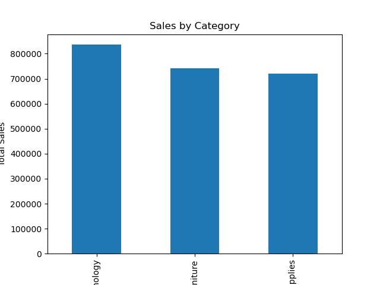
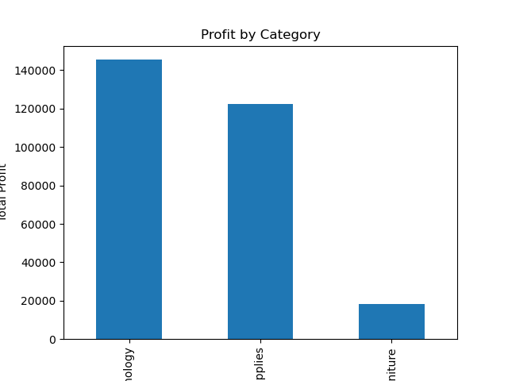
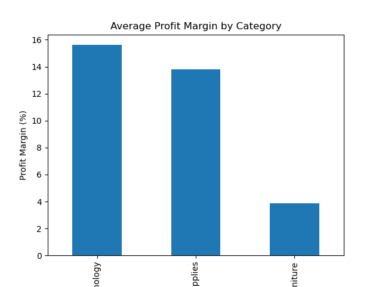
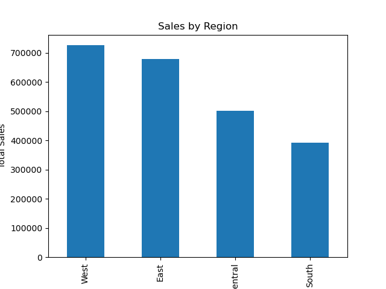
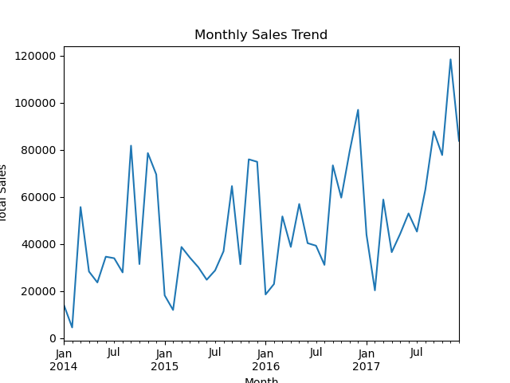

# Sales Data Analysis Project

This project analyzes retail sales data using Python.

## Dataset

This project uses the Sample Superstore dataset which contains retail sales information.

Main features in the dataset:

• Order Date  
• Sales  
• Profit  
• Category  
• Region  
• Customer ID  

The dataset is used to analyze business performance and identify profitable segments.

## Tools Used
- Python
- Pandas
- Matplotlib
- Jupyter Notebook

## Analysis Performed
- Sales Distribution by Category
- Profit by Category
- Profit Margin Analysis
- Sales by Region
- Monthly Sales Trend

## Key Insights
- Technology category has the highest profit margin
- Furniture category has low profitability
- West region generates highest sales
- Sales show seasonal trends across months

  ## Key Business Insights

• Technology category generates highest profit
• Furniture category has very low profit margin
• West region generates highest sales
• South region shows lower sales performance
• Monthly sales trend shows growth over time

  
## Project Visualizations

### Sales by Category

### Profit by Category

### Profit Margin Analysis

### Sales by Region

### Monthly Sales Trend

## Author
Karunya K
